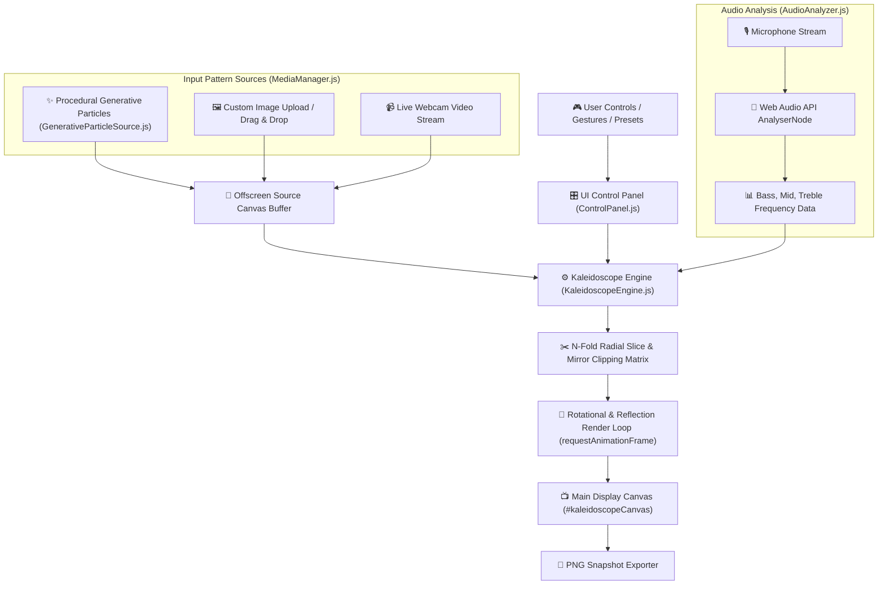
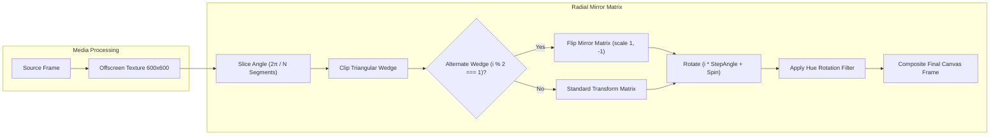

# 🎨 Digital Kaleidoscope - Interactive Visualizer Engine

A high-performance, real-time **Digital Kaleidoscope Web Application** built with Vite, modern HTML5 Canvas 2D/WebGL rendering, Tailwind CSS, and Web Audio API. It transforms dynamic procedural geometries, custom image uploads, live webcam video streams, and microphone audio frequencies into N-fold mirrored geometric art.

---

## 🌟 Architecture & System Flows

### 1. Engine & Render Loop Architecture


### 2. Multi-Input Source & Symmetry Processing Flow


---

## 🌟 Key Features

1. **N-Fold Radial Mirroring & Symmetry Engine**:
   - Customizable symmetry fold count from **3 to 32 segments**.
   - Toggleable **alternating mirror reflection** per wedge segment for seamless mandala geometry.
   - Dynamic pan offset via direct canvas click/touch drag gestures.
   - Interactive zoom scaling (0.2x to 4.0x) with mouse scroll wheel support.

2. **Multi-Input Pattern Sources**:
   - **Generative Particle System**: Swirling concentric polygons, orbiting stars, glowing rings, and organic wave curves.
   - **Interactive Paint / Draw Mode**: Paint live custom strokes directly onto the canvas with rainbow colors, custom color swatches, adjustable brush sizes, and instant N-fold radial symmetry projection.
   - **Custom Image Upload**: Load any photo (`PNG`, `JPG`, `WEBP`) via file picker or window drag-and-drop.
   - **Live Webcam Mirror**: Project live camera feed into real-time kaleidoscope mirror symmetry.

3. **Audio-Reactive Visualizer**:
   - Web Audio API integration (`AudioContext`, `AnalyserNode`) extracting real-time FFT spectrums (bass, mid, treble).
   - Audio frequencies dynamically pulse zoom scale, rotation velocity, and color spectrums in sync with music or microphone input.

4. **Glassmorphic UI & Preset Management**:
   - Sleek glassmorphism overlay built with Tailwind CSS and Lucide icons.
   - 6 Instant Visual Presets:
     - 🌌 **Cosmic Mandala**
     - ⚡ **Neon Cyber**
     - 🏛️ **Stained Glass**
     - 💧 **Liquid Gold**
     - 🌀 **Psychedelic Trip**
     - 💎 **Crystal Prism**

5. **Ultra-Fast & Optimized Bundle**:
   - Tree-shaken Lucide icons bundle (~26 KB total production JavaScript asset).
   - High FPS render loop powered by offscreen canvas double-buffering.

---

## 📁 Directory Structure

```text
kaleidoscope/
├── index.html                  # Main HTML viewport & glassmorphism UI layout
├── package.json                # Dependencies & Vite build scripts
├── vite.config.js              # Vite server & bundling configuration
├── tailwind.config.js          # Tailwind CSS theme customization
├── postcss.config.js           # PostCSS setup
├── justfile                    # Just command runner recipes
└── src/
    ├── main.js                 # Application entry point & render loop initialization
    ├── style.css               # Tailwind imports & custom glassmorphism styles
    ├── engine/
    │   ├── KaleidoscopeEngine.js       # Core N-fold symmetry mirror renderer
    │   ├── GenerativeParticleSource.js # Procedural shape & particle generator
    │   ├── AudioAnalyzer.js            # Web Audio API microphone frequency analyzer
    │   └── MediaManager.js             # Image upload & webcam video stream manager
    └── ui/
        └── ControlPanel.js             # UI controls, sliders, presets, & event handlers
```

---

## 🚀 Quickstart & Usage (`just`)

This project uses [`just`](https://github.com/casey/just) command runner for easy command execution.

### 1. Install Dependencies
```bash
just install
```

### 2. Start Local Development Server
```bash
just dev
```
Open **[http://localhost:3000](http://localhost:3000)** in your browser. Features Vite Hot Module Replacement (HMR).

### 3. Build Production Bundle
```bash
just build
```
Generates minified assets inside the `dist/` directory.

### 4. Preview Production Build
```bash
just preview
```

### 5. Lint & Build Check
```bash
just lint
```

### 6. Trigger Remote GitHub Actions Deploy
```bash
just deploy
```

### 7. View Live Deployment Status
```bash
just deploy-status
```

### 8. Open Live Web App in Browser
```bash
just open-live
```

### 9. Build, Commit & Push (Triggers Auto-Deploy)
```bash
just push msg="add new feature"
```

### 10. Clean Build Artifacts
```bash
just clean
```

---

## 🛠️ Technical Stack

- **Framework / Bundler**: Vite 5
- **Language**: Modern JavaScript (ES Modules)
- **Rendering Engine**: HTML5 Canvas 2D / WebGL Shaders & Double-Buffering
- **Audio Processing**: Web Audio API (`AudioContext`, `AnalyserNode`)
- **Styling**: Tailwind CSS & Glassmorphism design system
- **Iconography**: Lucide Icons
- **Command Runner**: `just`
